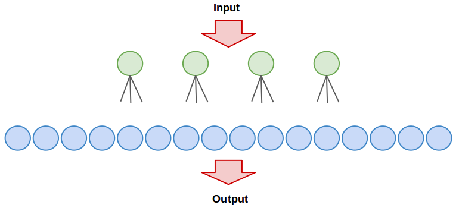

# Neural Network Exercise

This repository provides an exercise for students to implement delta learning for a neural network.
The network's task is to convert a 4-bit binary number into an 16-bit unary number.

The implementation of the neural network can be found in ```neuralnetwork.py```.
This module also contains the ```# TODO``` token where the students have to implement the delta learning algorithm.

In ```main.py``` the network for the conversion task is built. This network is a simple perceptron.
The training samples can be found in ```bin2un.txt```.

## Delta learning

Pseudocode for delta learning:

```
load training data
init lambda

repeat
    for input in data
        output = network.process(input)
        for i = 0 .. outneurons
            if output[i] != expected[i]
                weight[i] = weight[i] + lambda * input * (expected[i] - outval[i])
until network test succeeds
```

## Network


